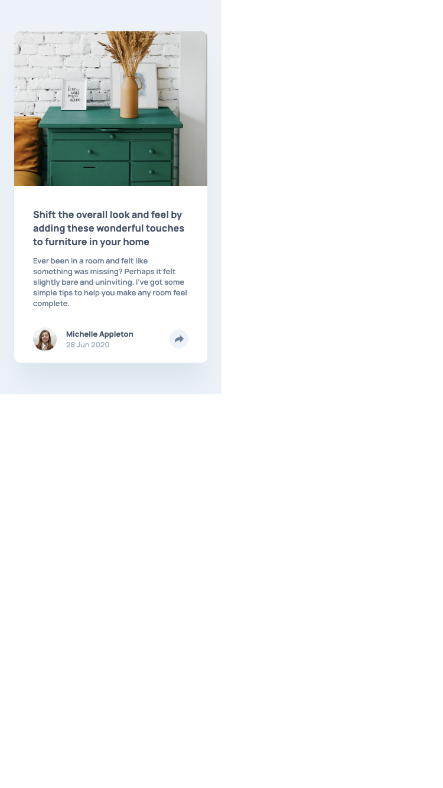
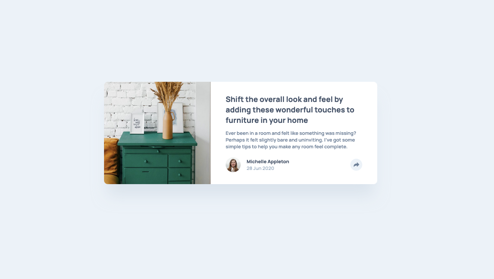

# Frontend Mentor - Article preview component solution

This is a solution to the [Article preview component challenge on Frontend Mentor](https://www.frontendmentor.io/challenges/article-preview-component-dYBN_pYFT). Frontend Mentor challenges help you improve your coding skills by building realistic projects.

## Table of contents

- [Overview](#overview)
  - [The challenge](#the-challenge)
  - [Screenshot](#screenshot)
  - [Links](#links)
- [My process](#my-process)
  - [Built with](#built-with)
  - [Continued development](#continued-development)
  - [Useful resources](#useful-resources)
- [Author](#author)
- [Acknowledgments](#acknowledgments)

## Overview

### The challenge

Users should be able to:

- View the optimal layout for the component depending on their device's screen size
- See the social media share links when they click the share icon

### Screenshot

#### Mobile 📲🔥

#### Desktop 💻🔥

### Links

- Solution URL: [Click here](https://github.com/jeancarlosruiz/article-preview-react)
- Live Site URL: [Click here](https://article-preview-react.netlify.app/)

## My process

### Built with

- [React](https://reactjs.org/) - JS library
- Semantic HTML5 markup
- [CSS Modules](https://css-tricks.com/css-modules-part-1-need/) - For styles
- Flexbox
- CSS Grid
- Mobile-first workflow
- Vite
- Deploy on Netlify

### Continued development

This is one of a set of small projects that I will be working on for continuous practice of ReactJs. On this one, I was practicing:

- Component
- CSS modules
- The useState hook
- Lifting states up
- Component instances.

### Useful resources

- [JoyOfReact](https://www.joyofreact.com/)

## Author

- Frontend Mentor - [@jeancarlosruiz](https://www.frontendmentor.io/profile/jeancarlosruiz)
- Twitter - [@JeanRuizV10](https://twitter.com/JeanRuizV10)

## Acknowledgments

I'd like to express my sincere gratitude for the amazing Joy of React course Josh W. Comeau has created. Thanks to your excellent teaching and guidance, I have learned so much about React and have been able to improve my skills in a significant way.
